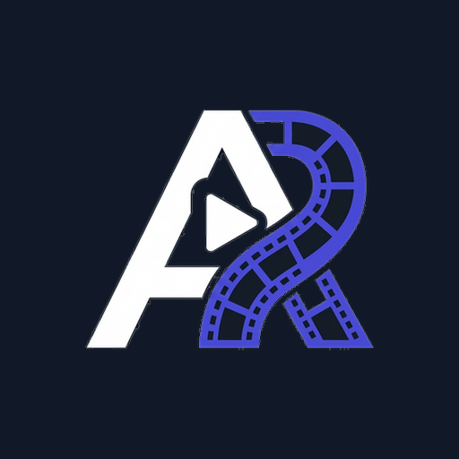
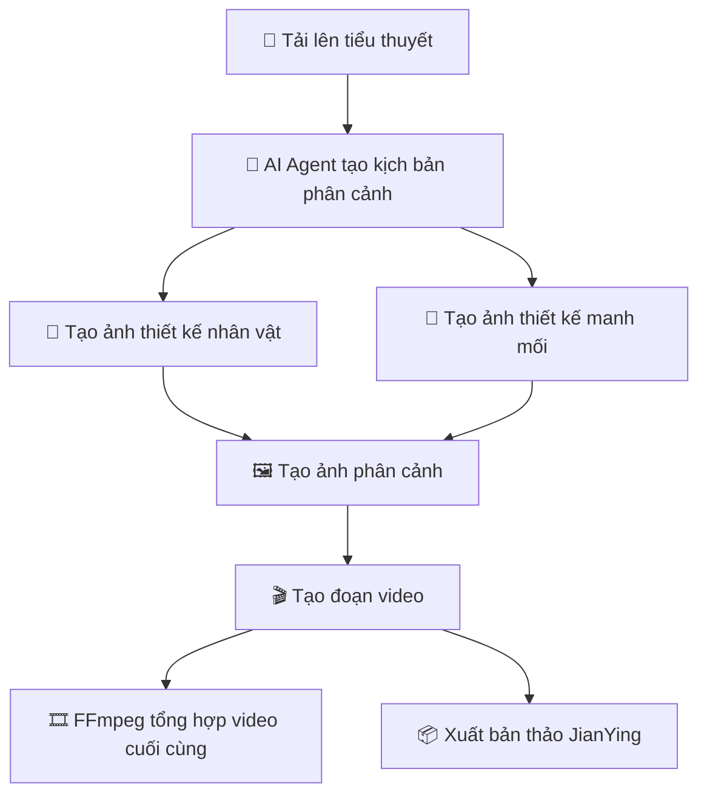
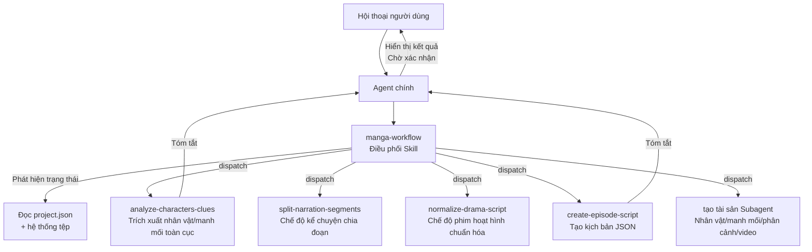
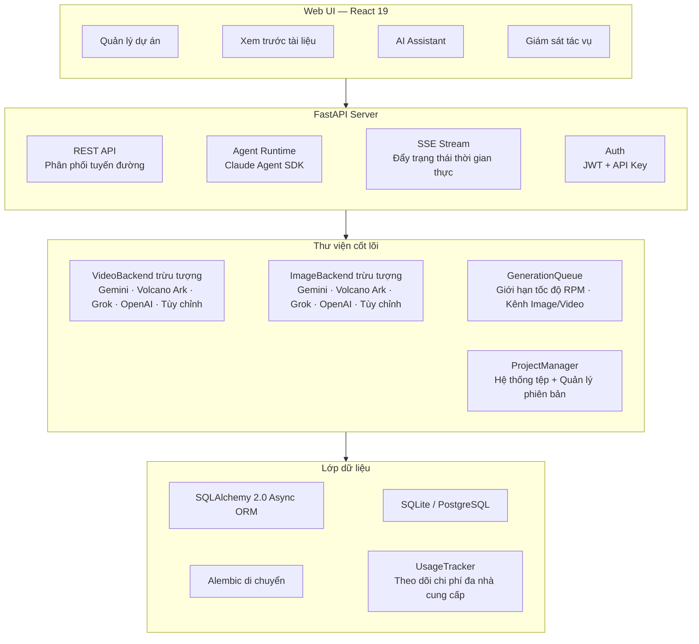

<h1 align="center">
  <br>
  <picture>
    <source media="(prefers-color-scheme: light)" srcset="frontend/public/android-chrome-maskable-512x512.png">
    <source media="(prefers-color-scheme: dark)" srcset="frontend/public/android-chrome-512x512.png">
    
  </picture>
  <br>
  ArcReel
  <br>
</h1>

<h4 align="center">Nền tảng AI tạo video mã nguồn mở — Từ tiểu thuyết đến video ngắn, được điều khiển bởi AI Agents</h4>
<h5 align="center">Open-source AI Video Generation Workspace — Novel to Short Video, Powered by AI Agents</h5>

<p align="center">
  <a href="#bắt-đầu-nhanh"></a>
  <a href="https://github.com/ArcReel/ArcReel/blob/main/LICENSE"></a>
  <a href="https://github.com/ArcReel/ArcReel"></a>
  <a href="https://github.com/ArcReel/ArcReel/pkgs/container/arcreel"></a>
  <a href="https://github.com/ArcReel/ArcReel/actions/workflows/test.yml"></a>
</p>

<p align="center">
  
  
  
  
  
  
  
  
</p>

<p align="center">
  
</p>

---

## Khả năng cốt lõi

<table>
  <tr>
    <td width="20%" align="center">
      <h3>🤖 Luồng làm việc AI Agent</h3>
      Dựa trên <strong>Claude Agent SDK</strong>, phối hợp Skill + Subagent tập trung đa tác nhân thông minh, tự động hoàn thành quy trình sản xuất đầy đủ từ sáng tạo kịch bản đến tổng hợp video
    </td>
    <td width="20%" align="center">
      <h3>🎨 Tạo ảnh đa nhà cung cấp</h3>
      <strong>Gemini</strong>, <strong>Volcano Ark</strong>, <strong>Grok</strong>, <strong>OpenAI</strong> và nhà cung cấp tùy chỉnh, thiết kế nhân vật đảm bảo tính nhất quán nhân vật, theo dõi manh mối đảm bảo đạo cụ/cảnh liên tục qua các ống kính
    </td>
    <td width="20%" align="center">
      <h3>🎬 Tạo video đa nhà cung cấp</h3>
      <strong>Veo 3.1</strong>, <strong>Seedance</strong>, <strong>Grok</strong>, <strong>Sora 2</strong> và nhà cung cấp tùy chỉnh, chuyển đổi toàn cục/cấp dự án
    </td>
    <td width="20%" align="center">
      <h3>⚡ Hàng đợi tác vụ bất đồng bộ</h3>
      Giới hạn tốc độ RPM + kênh Image/Video độc lập đồng thời, điều khi độ dựa trên lease, hỗ trợ truyền tiếp tục
    </td>
    <td width="20%" align="center">
      <h3>🖥️ Không gian làm việc trực quan</h3>
      Web UI quản lý dự án, xem trước tài liệu, quay lại phiên bản, theo dõi SSE tác vụ thời gian thực, tích hợp AI Assistant
    </td>
  </tr>
</table>

---

## Quy trình làm việc



---

## Bắt đầu nhanh

### Triển khai mặc định (SQLite)

```bash
git clone https://github.com/ArcReel/ArcReel.git
cd ArcReel/deploy

cp .env.example .env
docker compose up -d

# Truy cập http://localhost:1241
```

### Triển khai sản xuất (PostgreSQL)

```bash
cd ArcReel/deploy/production

cp .env.example .env    # Cần đặt POSTGRES_PASSWORD
docker compose up -d
```

Sau khi khởi động lần đầu, sử dụng tài khoản mặc định để đăng nhập (tên người dùng `admin`, mật khẩu được đặt qua `AUTH_PASSWORD` trong `.env`; nếu chưa đặt thì tự động tạo và ghi lại vào `.env`), đi đến **Trang cài đặt** (`/settings`) để hoàn tất cả cấu hình:

1. **ArcReel AI Agent** — Cấu hình Anthropic API Key (điều khiển AI Assistant), hỗ trợ Base URL tùy chỉnh và mô hình
2. **AI tạo ảnh/tạo video** — Cấu hình ít nhất một nhà cung cấp API Key (Gemini / Volcano Ark / Grok / OpenAI), hoặc thêm nhà cung cấp tùy chỉnh

> 📖 Các bước chi tiết vui lòng tham khảo [Hướng dẫn nhập môn đầy đủ](docs/getting-started.md)

---

## Tính năng

- **Quy trình sản xuất đầy đủ** — Tiểu thuyết → Kịch bản → Thiết kế nhân vật → Ảnh phân cảnh → Đoạn video → Hoàn thành, phối hợp một cú nhấn
- **Kiến trúc đa tác nhân thông minh** — Sắp xếp Skill phát hiện trạng thái dự án và tự động điều phối Subagent tập trung, mỗi Subagent chỉ hoàn thành một nhiệm vụ sau đó trả về tóm tắt
- **Hỗ trợ đa nhà cung cấp** — Tạo ảnh/video/văn bản đều hỗ trợ Gemini, Volcano Ark, Grok, OpenAI bốn nhà cung cấp lớn, chuyển đổi toàn cục/cấp dự án
- **Nhà cung cấp tùy chỉnh** — Nhập bất kỳ API tương thích OpenAI / Google tương thích (như Ollama, vLLM, trung chuyển bên thứ ba), tự động phát hiện mô hình có sẵn và phân bổ loại phương tiện, hưởng các tính năng tương đương với nhà cung cấp định sẵn
- **Hai chế độ nội dung** — Chế độ kể chuyện (narration) chia đoạn theo nhịp đọc, chế độ phim hoạt hình (drama) tổ chức theo cảnh/hội thoại
- **Lập kế phân tập tiến dần** — Hợp tác cắt tiểu thuyết dài: peek phát hiện → Agent đề xuất điểm ngắt → Người dùng xác nhận → Cắt thủ công, sản xuất theo nhu cầu
- **Ảnh tham chiếu phong cách** — Tải lên ảnh phong cách, AI tự động phân tích và áp dụng thống nhất cho tất cả tạo ảnh, đảm bảo tính nhất quán thị giác toàn dự án
- **Tính nhất quán nhân vật** — AI tạo ảnh thiết kế nhân vật trước, tất cả phân cảnh và video sau đó đều tham chiếu thiết kế này
- **Theo dõi manh mối** — Đánh dấu đạo cụ/cảnh quan trọng là "manh mối", đảm bảo tính nhất quán thị giác qua các ống kính
- **Lịch sử phiên bản** — Mỗi lần tạo lại tự động lưu lịch sử phiên bản, hỗ trợ quay lại một cú nhấn
- **Theo dõi chi phí đa nhà cung cấp** — Tạo ảnh/video/văn bản tất cả được đưa vào tính chi phí, tính phí theo chiến lược nhà cung cấp, thống kê tiền tệp riêng biệt

---

## Hỗ trợ nhà cung cấp

ArcReel thông qua giao thức `ImageBackend` / `VideoBackend` / `TextBackend` thống nhất, hỗ trợ nhiều nhà cung cấp định sẵn và nhà cung cấp tùy chỉnh, có thể chuyển đổi ở cấp toàn cục hoặc cấp dự án:

### Nhà cung cấp ảnh

| Nhà cung cấp | Mô hình có thể dùng | Khả năng | Cách tính phí |
|--------|----------|------|----------|
| **Gemini** (Google) | Nano Banana 2, Nano Banana Pro | Tạo ảnh văn bản, tạo ảnh có nhiều tham chiếu | Theo bảng tra cứu độ phân giải (USD) |
| **Volcano Ark** | Seedream 5.0, Seedream 5.0 Lite, Seedream 4.5, Seedream 4.0 | Tạo ảnh văn bản, tạo ảnh có nhiều tham chiếu | Theo tấm tính phí (CNY) |
| **Grok** (xAI) | Grok Imagine Image, Grok Imagine Image Pro | Tạo ảnh văn bản, tạo ảnh có nhiều tham chiếu | Theo tấm tính phí (USD) |
| **OpenAI** | GPT Image 1.5, GPT Image 1 Mini | Tạo ảnh văn bản, tạo ảnh có nhiều tham chiếu | Theo tấm tính phí (USD) |

### Nhà cung cấp video

| Nhà cung cấp | Mô hình có thể dùng | Khả năng | Cách tính phí |
|--------|----------|------|----------|
| **Gemini** (Google) | Veo 3.1, Veo 3.1 Fast, Veo 3.1 Lite | Tạo video, tạo ảnh có video, mở rộng video, từ chối tiêu cực | Theo độ phân giải × thời lượng tra cứu bảng (USD) |
| **Volcano Ark** | Seedance 2.0, Seedance 2.0 Fast, Seedance 1.5 Pro | Tạo video, tạo ảnh có video, mở rộng video, tạo âm thanh, điều khiển hạt, suy luận ngoại tuyến | Theo lượng sử dụng token (CNY) |
| **Grok** (xAI) | Grok Imagine Video | Tạo video, tạo ảnh có video | Theo giây tính phí (USD) |
| **OpenAI** | Sora 2, Sora 2 Pro | Tạo video, tạo ảnh có video | Theo giây tính phí (USD) |

### Nhà cung cấp văn bản

| Nhà cung cấp | Mô hình có thể dùng | Khả năng | Cách tính phí |
|--------|----------|------|----------|
| **Gemini** (Google) | Gemini 3.1 Flash, Gemini 3.1 Flash Lite, Gemini 3 Pro | Tạo văn bản, xuất có cấu trúc, hiểu thị giác | Theo lượng sử dụng token (USD) |
| **Volcano Ark** | Doubao Seed series | Tạo văn bản, xuất có cấu trúc, hiểu thị giác | Theo lượng sử dụng token (CNY) |
| **Grok** (xAI) | Grok 4.20, Grok 4.1 Fast series | Tạo văn bản, xuất có cấu trúc, hiểu thị giác | Theo lượng sử dụng token (USD) |
| **OpenAI** | GPT-5.4, GPT-5.4 Mini, GPT-5.4 Nano | Tạo văn bản, xuất có cấu trúc, hiểu thị giác | Theo lượng sử dụng token (USD) |

### Nhà cung cấp tùy chỉnh

Ngoài các nhà cung cấp định sẵn, có thể nhập bất kỳ **API tương thích OpenAI** hoặc **API tương thích Google**:

- Thêm nhà cung cấp tùy chỉnh trên trang cài đặt, điền Base URL và API Key
- Tự động gọi `/v1/models` để phát hiện mô hình có sẵn, phân bổ loại phương tiện (ảnh/video/văn bản) theo tên
- Hưởng các tính năng tương đương với nhà cung cấp định sẵn: chuyển đổi toàn cục/cấp dự án, theo dõi chi phí, quản lý phiên bản

**Ưu tiên lựa chọn nhà cung cấp**: Cài đặt cấp dự án > Cài đặt toàn cục > Giá trị mặc định. Khi chuyển đổi nhà cung cấp, cài đặt chung (độ phân giải, tỷ lệ khung hình, âm thanh v.v.) được kế thừa trực tiếp, các tham số riêng của nhà cung cấp được giữ lại.

---

## Kiến trúc AI Assistant

ArcReel xây dựng AI Assistant dựa trên **Claude Agent SDK**, sử dụng kiến trúc **Điều phối Skill + Subagent tập trung đa tác nhân thông minh**:



**Nguyên tắc thiết kế cốt lõi:**

- **Điều phối Skill (manga-workflow)** — Có khả năng phát hiện trạng thái, tự động phán đoán giai đoạn hiện tại của dự án (thiết kế nhân vật / lập kế phân tập / tiền xử lý / tạo kịch bản / tạo tài sản), dispatch Subagent tương ứng, hỗ trợ nhập và phục hồi từ bất kỳ giai đoạn nào
- **Subagent tập trung** — Mỗi Subagent chỉ hoàn thành một nhiệm vụ sau đó trả về, văn bản gốc tiểu thuyết v.v. được giữ lại trong Subagent, Agent chính chỉ nhận tóm tắt đã tinh lọc, bảo vệ không gian ngữ cảnh
- **Ranh giới Skill vs Subagent** — Skill chịu trách nhiệm thực thi kịch bản xác định (gọi API, tạo tệp), Subagent chịu trách nhiệm nhiệm vụ cần suy luận phân tích (trích xuất nhân vật, chuẩn hóa kịch bản)
- **Xác nhận giữa các giai đoạn** — Mỗi Subagent trả về sau đó, Agent chính hiển thị tóm tắt kết quả cho người dùng và chờ xác nhận, mới chuyển sang giai đoạn tiếp theo

---

## Tích hợp OpenClaw

ArcReel hỗ trợ gọi qua [OpenClaw](https://openclaw.ai) nền tảng AI Agent bên ngoài, thực hiện sáng tạo video điều khiển bởi ngôn ngữ tự nhiên:

1. Tạo API Key tiền tố `arc-` trên trang cài đặt ArcReel
2. Trong OpenClaw tải định nghĩa Skill của ArcReel (truy cập `http://your-domain/skill.md` tự động lấy)
3. Thông qua hội thoại OpenClaw có thể tạo dự án, tạo kịch bản, sản xuất video

**Triển khai kỹ thuật:** Xác thực API Key (Bearer Token) + điểm cuối hội thoại đồng bộ Agent (`POST /api/v1/agent/chat`), tích hợp luồng SSE trợ lý và thu thập phản hồi hoàn chỉnh.

---

## Kiến trúc kỹ thuật



---

## Ngăn xếp kỹ thuật

| Cấp độ | Kỹ thuật |
|------|------|
| **Frontend** | React 19, TypeScript, Tailwind CSS 4, wouter, zustand, Framer Motion, Vite |
| **Backend** | FastAPI, Python 3.12+, uvicorn, Pydantic 2 |
| **AI Agent** | Claude Agent SDK (Skill + Subagent kiến trúc đa tác nhân thông minh) |
| **Tạo ảnh** | Gemini (`google-genai`), Volcano Ark (`volcengine-python-sdk[ark]`), Grok (`xai-sdk`), OpenAI (`openai`) |
| **Tạo video** | Gemini Veo 3.1 (`google-genai`), Volcano Ark Seedance 2.0/1.5 (`volcengine-python-sdk[ark]`), Grok (`xai-sdk`), OpenAI Sora 2 (`openai`) |
| **Tạo văn bản** | Gemini (`google-genai`), Volcano Ark (`volcengine-python-sdk[ark]`), Grok (`xai-sdk`), OpenAI (`openai`), Instructor (xuất có cấu trúc hạ cấp) |
| **Xử lý media** | FFmpeg, Pillow |
| **ORM & CSDL** | SQLAlchemy 2.0 (async), Alembic, aiosqlite, asyncpg — SQLite (mặc định) / PostgreSQL (sản xuất) |
| **Xác thực** | JWT (`pyjwt`), API Key (SHA-256 băm), Argon2 băm mã (`pwdlib`) |
| **Triển khai** | Docker, Docker Compose (`deploy/` mặc định, `deploy/production/` có PostgreSQL) |

---

## Tài liệu

- 📖 [Hướng dẫn nhập môn đầy đủ](docs/getting-started.md) — Hướng dẫn từng bước từ con số 0
- 📦 [Hướng dẫn xuất bản thảo JianYing](docs/jianying-export-guide.md) — Nhập đoạn video đã tạo vào JianYing bản máy tính để chỉnh sửa lần hai
- 💰 [Mô tả chi phí Google GenAI](docs/google-genai-docs/Google-video-anh-phi-tham-khau.md) — Tham khảo chi phí tạo ảnh Gemini / Veo video
- 💰 [Mô tả chi phí Volcano Ark](docs/ark-docs/Volcano-Ark-phi-tham-khau.md) — Tham khảo chi phí video/ảnh/văn bản mô hình Volcano Ark

---

## Đóng góp

Chào mừng đóng góp mã, báo cáo Bug hoặc đề xuất tính năng!

### Môi trường phát triển cục bộ

```bash
# Yêu cầu: Python 3.12+, Node.js 20+, uv, pnpm, ffmpeg

# Cài đặt phụ thuộc
uv sync
cd frontend && pnpm install && cd ..

# Khởi tạo CSDL
uv run alembic upgrade head

# Khởi động backend (terminal 1)
uv run uvicorn server.app:app --reload --port 1241

# Khởi động frontend (terminal 2)
cd frontend && pnpm dev

# Truy cập http://localhost:5173
```

### Kiểm thử chạy

```bash
# Kiểm thử backend
python -m pytest

# Kiểm thử kiểu + kiểm thử frontend
cd frontend && pnpm check
```

---

## Giấy phép

[AGPL-3.0](LICENSE)

---

<p align="center">
  Nếu thấy dự án hữu ích, hãy cho một ⭐ Star ủng hộ!
</p>
